# css-code

> css 特效，css的代码段

## 01.虚线边框效果
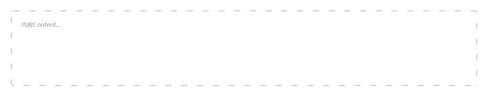

## 02.单行、多行文本超出省略号
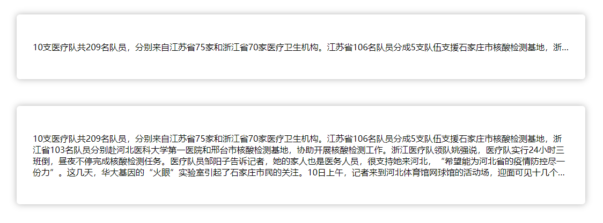

## 04.气泡动态背景

## 05.动画自动打字
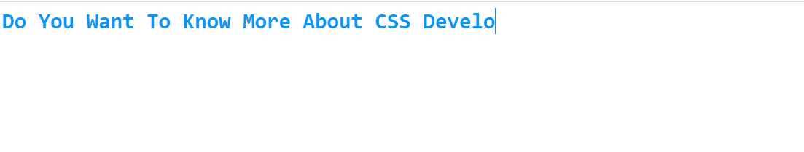

## 06.滚动条去除，依旧可以正常滚动
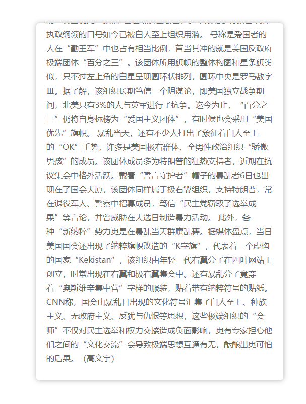

## 07.背景渐变，动画
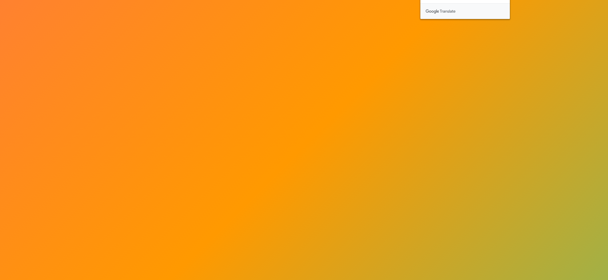

## 09.动态边框，动画
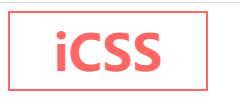

## 10.下划线跟随导航栏
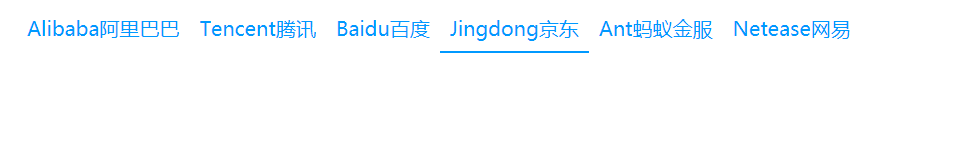

## 11.背景格子
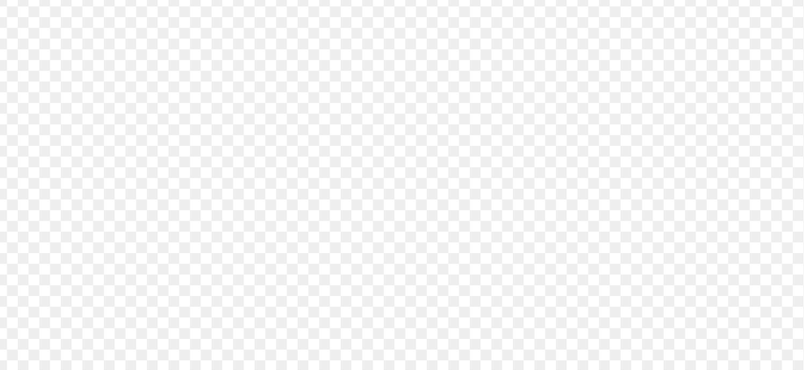

## 12.描绘波浪线
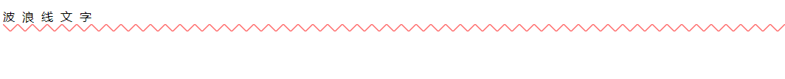

## 13.灰度模式
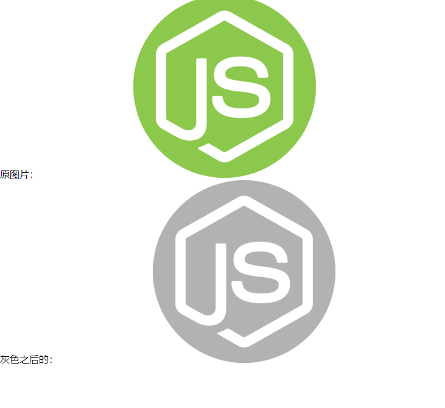

## 14.竖向排版
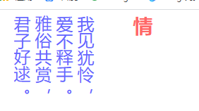

## 15.图片模糊

## 16.三角形
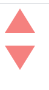

## 17.css画形状

## 18.字体发光
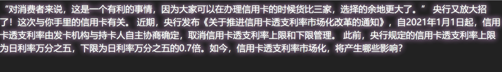

## 19.border-radius 的斜线语法
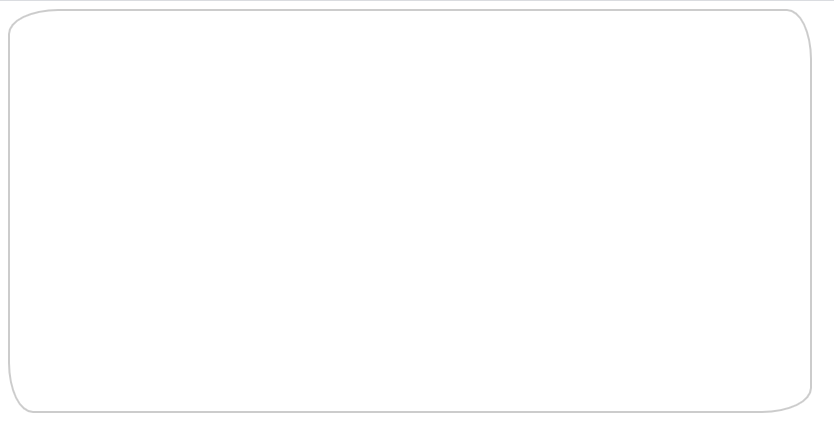

## 20.悬停放大，完美的css设置body背景图片铺满

## 21.多背景

## 22.三角形背景
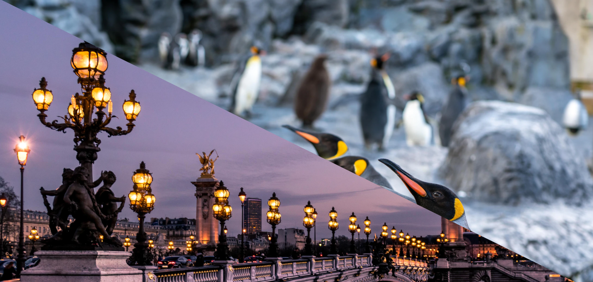
